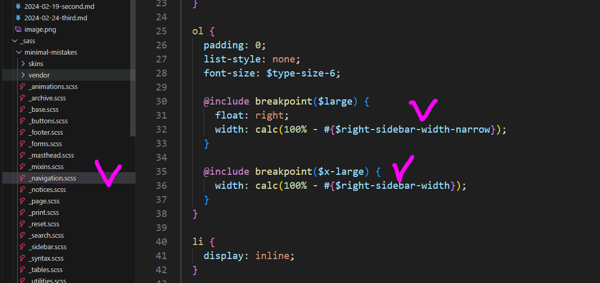
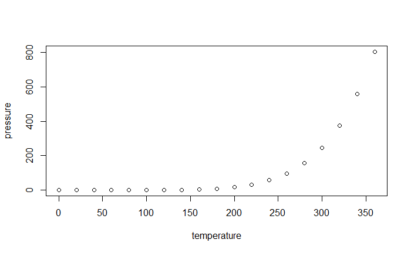

# 엑셀 판매데이터

dfg
## 엑셀 판매데이터 세부1

 - ㅁㅇㄴ마니누리
 - 하야이꾸
### 엑셀 판매데이터 세부세부1

1. 메ㅓ싴


무루깡
1. ㅁㄴㅇㄹ

2. ㅁㄴㅇ람ㄴㅇ라

# 엑셀 판매데이터2
## 엑셀 판매데이터 세부2


1. 123123
2. ㅀㄴㅀ
### 엑셀 판매데이터 세부세부2

| 번호 | 이름  | 성별 | 국어 | 수학 | 영어 | 사회 | 과학 | 미술 | 음악 | 체육 | 기술 | 한국 | 한문 | 교양 | 총점 | 등급 | 등급(세부) |
| -- | --- | -- | -- | -- | -- | -- | -- | -- | -- | -- | -- | -- | -- | -- | -- | -- | ------ |
| 1  | 은송희 | 여  | 63 | 90 | 93 | 51 | 74 | 84 | 8  | 32 | 15 | 63 | 53 | 6  |    |    |        |
| 2  | 방원미 | 여  | 91 | 39 | 37 | 5  | 68 | 94 | 94 | 8  | 99 | 2  | 94 | 16 |    |    |        |
| 3  | 지재린 | 여  | 44 | 79 | 88 | 92 | 37 | 2  | 20 | 79 | 49 | 14 | 88 | 80 |    |    |        |
| 4  | 나슬송 | 여  | 7  | 43 | 11 | 84 | 66 | 23 | 32 | 21 | 74 | 60 | 94 | 75 |    |    |        |
| 5  | 여예옥 | 남  | 63 | 19 | 54 | 84 | 10 | 70 | 84 | 74 | 73 | 63 | 99 | 81 |    |    |        |
| 6  | 윤정선 | 여  | 21 | 18 | 66 | 19 | 89 | 92 | 25 | 41 | 71 | 21 | 28 | 14 |    |    |        |

| \-100.0 |
| ------- |
| \-100.0 |
| \-100.0 |
| \-100.0 |
| \-100.0 |

```
=VLOOKUP(J17,$J$7:$L$12,3,0)
```
| 행 레이블 | 합계 : 매출(천원) |
| ----- | ----------- |
| 20대이하 | 602347.94   |
| 30대   | 6836638.466 |
| 40대   | 9985890.497 |
| 50대   | 12612836.97 |
| 60대   | 5927105.425 |
| 70대이상 | 5710131.466 |

$x^2 + y^2 = z^2$

$$
\begin{align}
\sum_{n=1}^{2}(\alpha ^2 + \beta ^3 + 5) = 1
\end{align}
$$

\sum_{n=1}^{2}(\alpha ^2 + \beta ^3 + 5) = 1

| **번호** | **이름** | **성별** | **국어** | **수학** | **영어** | **사회** | **과학** |
|:------:|:------:|:------:|:------:|:------:|:------:|:------:|:------:|
| 1      | 은송희    | 여      | 63     | 90     | 93     | 51     | 74     |
| 2      | 방원미    | 여      | 91     | 39     | 37     | 5      | 68     |
| 3      | 지재린    | 여      | 44     | 79     | 88     | 92     | 37     |
| 4      | 나슬송    | 여      | 7      | 43     | 11     | 84     | 66     |
| 5      | 여예옥    | 남      | 63     | 19     | 54     | 84     | 10     |
| 6      | 윤정선    | 여      | 21     | 18     | 66     | 19     | 89     |
| 7      | 원세완    | 남      | 77     | 94     | 6      | 42     | 24     |
| 8      | 노가운    | 여      | 43     | 44     | 83     | 90     | 39     |
| 9      | 임의준    | 남      | 50     | 74     | 74     | 50     | 97     |



```r
a<-1
b<-2
a+b

plot(pressure)
```

| 2022년 VIP등급 | ID        | Date       | 브랜드     | 매출     | 비용  |
|-------------|-----------|------------|---------|--------|-----|
| RVIP        | 100003871 | 2022-05-16 | 14로aive | 380    | 21  |
| RVIP        | 100003871 | 2022-05-20 | 14로aive | 460    | 28  |
| RVIP        | 100003871 | 2022-05-22 | 어메소     | 2338   | 161 |
| RVIP        | 100003871 | 2022-05-22 | 지포가     | 1306   | 91  |
| RVIP        | 100003871 | 2022-05-29 | 어메소     | -891   | -56 |
| RVIP        | 100100021 | 2022-05-15 | 타임데     | 1605   | 112 |
| RVIP        | 100100021 | 2022-05-17 | 제냐가     | 290    | 14  |
| RVIP        | 100100021 | 2022-05-19 | 페델리브    | 833    | 56  |
| RVIP        | 100100021 | 2022-05-25 | 페델리브    | 4706   | 329 |
| RVIP        | 100100021 | 2022-05-26 | 배로      | 13190  | 917 |
| RVIP        | 100123775 | 2022-05-16 | 맨즈라가    | 165    | 7   |
| RVIP        | 100206791 | 2022-05-01 | 아미데     | 1390   | 91  |
| RVIP        | 100207004 | 2022-05-15 | 브데      | 3657.6 | 252 |
| RVIP        | 100207004 | 2022-05-26 | 브데      | 645.3  | 42  |
| RVIP        | 100249228 | 2022-05-14 | 갤럭바     | 1259   | 84  |

```
| 2022년 VIP등급 | ID        | Date       | 브랜드     | 매출     | 비용  |
|-------------|-----------|------------|---------|--------|-----|
| RVIP        | 100003871 | 2022-05-16 | 14로aive | 380    | 21  |
| RVIP        | 100003871 | 2022-05-20 | 14로aive | 460    | 28  |
| RVIP        | 100003871 | 2022-05-22 | 어메소     | 2338   | 161 |
| RVIP        | 100003871 | 2022-05-22 | 지포가     | 1306   | 91  |
| RVIP        | 100003871 | 2022-05-29 | 어메소     | -891   | -56 |
| RVIP        | 100100021 | 2022-05-15 | 타임데     | 1605   | 112 |
| RVIP        | 100100021 | 2022-05-17 | 제냐가     | 290    | 14  |
| RVIP        | 100100021 | 2022-05-19 | 페델리브    | 833    | 56  |
| RVIP        | 100100021 | 2022-05-25 | 페델리브    | 4706   | 329 |
| RVIP        | 100100021 | 2022-05-26 | 배로      | 13190  | 917 |
| RVIP        | 100123775 | 2022-05-16 | 맨즈라가    | 165    | 7   |
| RVIP        | 100206791 | 2022-05-01 | 아미데     | 1390   | 91  |
| RVIP        | 100207004 | 2022-05-15 | 브데      | 3657.6 | 252 |
| RVIP        | 100207004 | 2022-05-26 | 브데      | 645.3  | 42  |
| RVIP        | 100249228 | 2022-05-14 | 갤럭바     | 1259   | 84  |
```


| 행 레이블                     | 합계 : 매출    |   |   |   |
| PX무                       | 243,601    |   |   |   |
| 구찌브                       | 417,994    |   |   |   |
| 레스드                       | 322,261    |   |   |   |
| 로로피데                      | 388,599    |   |   |   |
| 루이무                       | 1,063,924  |   |   |   |
| 르무                        | 244,249    |   |   |   |
| 리소                        | 371,305    |   |   |   |
| 무소                        | 274,962    |   |   |   |
| 발렌시데                      | 251,707    |   |   |   |
| 발바                        | 406,088    |   |   |   |
| 쉐르무                       | 194,916    |   |   |   |
| 아미데                       | 256,611    |   |   |   |
| 에르로비뇨                     | 194,517    |   |   |   |
| 이세가                       | 195,083    |   |   |   |
| 제이데버                      | 239,593    |   |   |   |
| 지포가                       | 585,753    |   |   |   |
| 콜롬무                       | 196,664    |   |   |   |
| 파무나필립피                    | 220,571    |   |   |   |
| 프라다로                      | 376,247    |   |   |   |
| 플리츠소                      | 188,137    |   |   |   |
| 총합계                       | 6,632,782  |

python
```python
import matplotlib.pyplot as plt
import seaborn as sns
%matplotlib inline
plt.style.use(['dark_background'])

# displot 활용 분포 그리기 
sns.displot(df['col']);

# 분포의 평균도 같이 출력
print("col :", df['col'].mean())
```
R
```r
library(plotly)
plot_ly(x = ~rnorm(100), type = "histogram")
```
rrr
```r
library(ggplot2)
ggplot(data = mpg, aes(x = displ, y = hwy)) + geom_point()
```

```r
# 예제 데이터 생성
data <- data.frame(
  Name = c("Alice", "Bob", "Charlie"),
  Age = c(25, 30, 35),
  Score = c(80, 85, 90)
)

# 테이블 출력
knitr::kable(data)
```